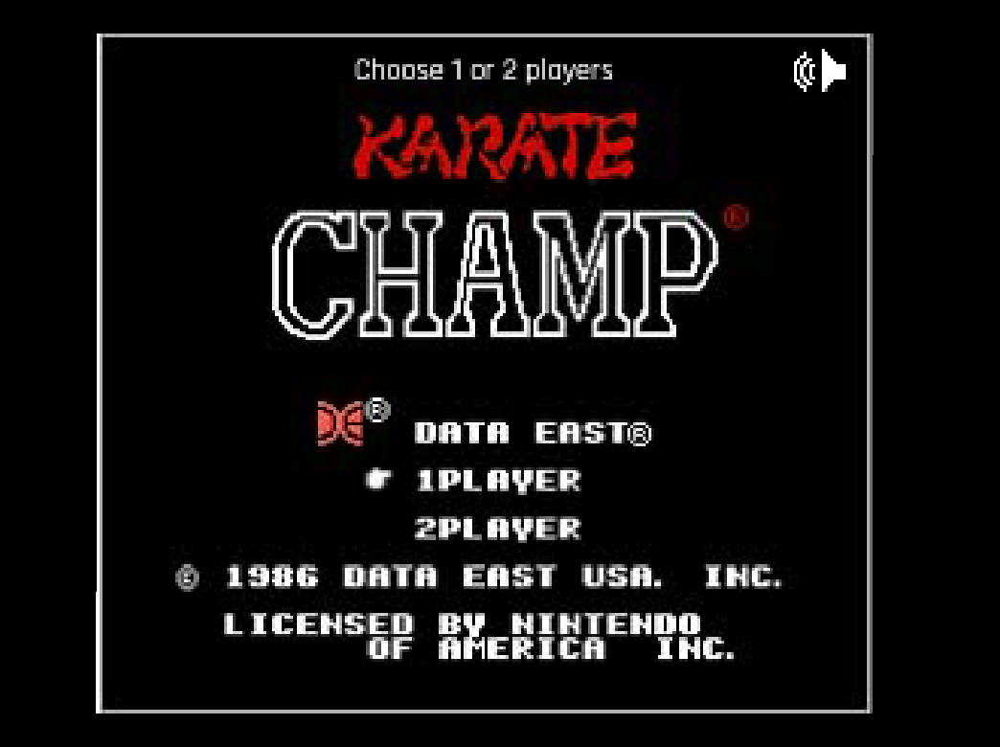

# Karate Champ Phaser 3

## Description

Phaser 3 version of the Arcade Game "Karate Champ"

# Features

-   Webpack 4
-   babel 7 +
-   Es6 support
-   Prettier Style
-   Easy deployment to gh-pages
-   Webpack bundle analyzer
-   Howler 2 for Audio
-   Browsersync
-   Project Complexity analysis `yarn complexity-report`
-   Tilemap processing (extrusion and minification and more)
-   Image processing (moving and compression with pngquant)
-   Audio processing (Audiosprite Creation)

# Installation

1.  Clone the repo
2.  `yarn install`
3.  `yarn start`

## Game Play

TBD

### Player Movement

TBD